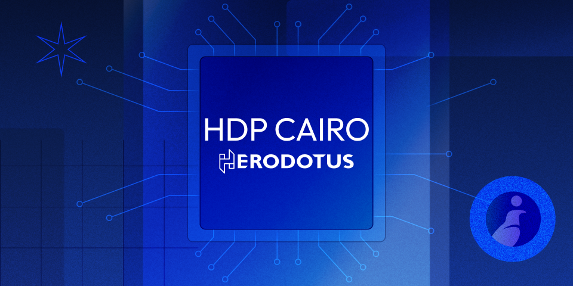

# HDP Cairo

HDP (Herodotus Data Processor) is a modular framework for validating on-chain data from multiple blockchain RPC sources, executing user-defined logic written in Cairo1, and producing an execution trace that can be used to generate a zero-knowledge proof. The proof attests to the correctness of both the on-chain data and the performed computation.

---

<p align="center">
  
</p>

---

<p align="left">
  <a href="https://herodotusdev.github.io/hdp-cairo/program_hash.json">
    
  </a>
</p>

---

## Installation

### Option 1: Install CLI Directly

You can install the CLI using install script:

```bash
curl -fsSL https://raw.githubusercontent.com/HerodotusDev/hdp-cairo/main/install-cli.sh | bash
```

### Option 2: Build from Source

To install the required dependencies and set up the Python virtual environment, run:

```bash
make
```

## Running

Runtime require chain nodes RPC calls, ensure an environment variables [.env](example.env) are set.

### Steps to Execute:

1. **Simulate Cairo1 Module and Collect Proofs Information:**

   ```bash
   cargo run --release --bin hdp-cli -- dry-run -m module_contract_class.json --print_output
   ```

   `module_contract_class.json` is built contract code from `Scarb` build, more specific example in [DOCS](./docs/src/getting_started.md)

2. **Fetch On-Chain Proofs Needed for the HDP Run:**

   ```bash
   cargo run --release --bin hdp-cli --features progress_bars -- fetch-proofs
   ```

3. **Run Cairo1 Module with Verified On-Chain Data:**

   ```bash
   cargo run --release --bin hdp-cli -- sound-run -m module_contract_class.json --print_output
   ```

   `module_contract_class.json` is built contract code from `Scarb` build, more specific example in [DOCS](./docs/src/getting_started.md)

The program will output the results root and tasks root. These roots can be used to extract the results from the on-chain contract.

## Testing

Tests require chain nodes RPC calls. Ensure an environment variables [.env](example.env) are set.

1. **Build Cairo1 Modules:**

   ```bash
   scarb build
   ```

2. **Run Tests with [nextest](https://nexte.st/):**
   ```bash
   cargo nextest run
   ```

## Note on on-chain finality

Even if all stages work successfully (dry run, proof fetching, sound run), for the on-chain settlement to be completed, the MMR (Merkle Mountain Range) data of all accessed values must be present in the MMR core module we use to settle. This means that the blocks containing the data you're accessing must have been included in the MMR that the settlement contract uses, which isn't always the case when mixing testnet and mainnet or for cross-chain data access within the same HDP module.

If you encounter issues during on-chain settlement despite successful local execution, verify that the block numbers you're accessing have been properly included in the on-chain MMR data structure.
