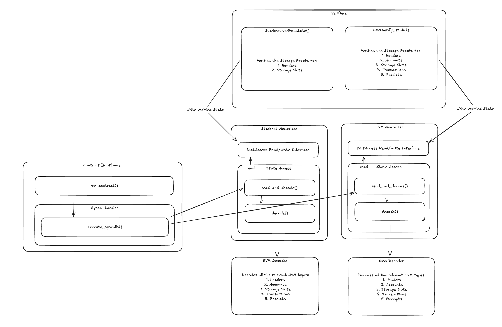

# HDP Cairo

Cairo HDP is a collection of Cairo0 programs designed to verify inclusion proofs and perform computations on the data. These computations can be verified on-chain, enabling trustless operations on any historical data from Ethereum or integrated EVM chains.

## Installation and Setup

To install the required dependencies and set up the Python virtual environment, run:

```bash
make setup
```

Ensure you run the Cairo program from the virtual environment. To activate the virtual environment, execute:

```bash
source venv/bin/activate
```

## Running

Before running the program, prepare the input data. The inputs are provided via the `hdp_input.json` file located in the root directory of the HDP project. These inputs can be generated using the [HDP CLI](https://github.com/HerodotusDev/hdp). Example inputs are available in `tests/hdp/fixtures`.

To run the program, use:

```bash
make run-hdp
```

The program will output the results root and tasks root. These roots can be used to extract the results from the on-chain contract.

## How It Works

HDP Cairo is the repository containing the logic for verifying on-chain state via storage proofs, and then making that state available to custom Cairo1 contract modules. To enable this functionality, a custom syscall was designed, enabling dynamic access to the verified state. The syscalls are defined in `cairo1_syscall_binding` where we have some examples.

### Architecture
The overall program is split into two main parts:

### Architecture
The overall program is split into two main parts:




### 1. Storage Proof Verification
In the first stage, we verify the storage proofs found in the `hdp_input.json` file. This file contains all the storage proof for the state required by the contracts execution. This file is generated in the Dry Run stage, where we mock the execution and extract the state that was accessed by the contract. This enables the dynamic access of state from the contract, while ensuring everything can be proven in a sound way. Once this stage is complete, all of the verified state is stored in the memorizers, allowing it to be queried via syscall.

### 2. Bootloading
In this stage, we bootload the cairo1 contract. The contracts bytecode is read from the `hdp_input.json` file and now executed in the HDP bootloader. The bootloader now processes the bytecode, and invokes the contained syscalls. These syscalls are then proccessed, fetching and decoding the requested state from the memorizers and loading it into the contracts memory. This enables the seamless access of verified on-chain state in contracts.

## Testing

Some tests require Ethereum Mainnet RPC calls. Ensure an environment variable named `RPC_URL_MAINNET` is set.

To run the tests (from the virtual environment), execute:

```bash
make test-full
```
