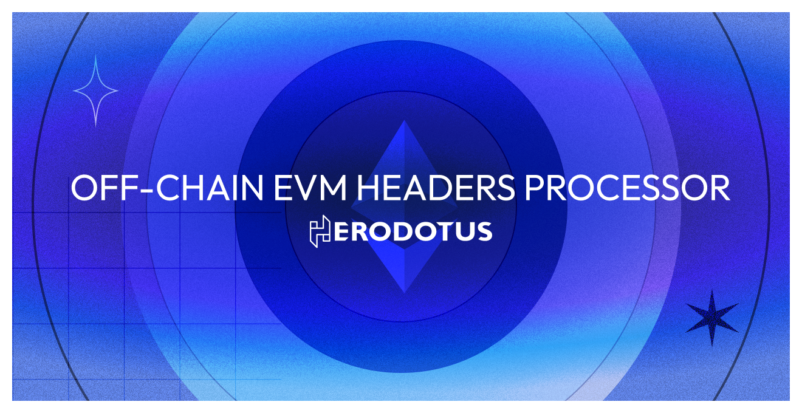
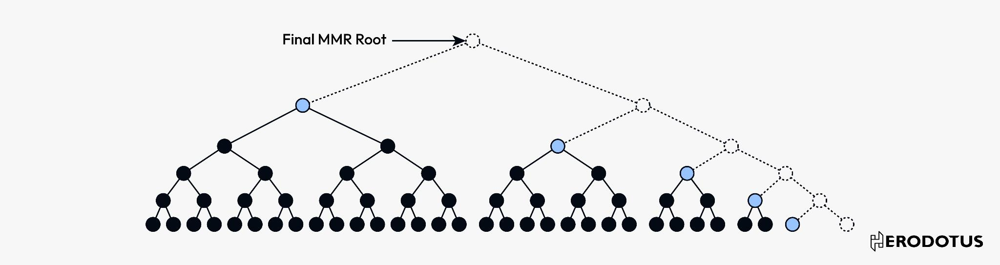

# Off-chain EVM Headers Processor



---

This repository implements the logic of building and maintaining two Merkle Mountain Ranges (MMRs) containing only provably valid Ethereum block headers.

Visualization of an MMR


Building the MMRs happens off-chain and is proven using a Cairo program in the `src` directory.
The CAIRO program takes as an input a blockhash passed by the verifier to then provide preimages to the given blockhash or a decoded parent hash that must be valid block headers.

Please read [src/single_chunk_processor/README.md](src/single_chunk_processor/README.md) for more details about the chunk processor.

Visualization of the linkage between blocks.


The 2 MMRs store the same data and have the same size however are built with two different hash functions:

- Poseidon over the stark field
- Keccak256
  The values at the bottom of the MMR are keccak/poseidon hashes of the RLP encoded block headers.

The Starkware SHARP generates the proofs, and the proof verification happens on-chain. The resulting facts are then aggregated by the contracts implemented in the directory `solidity-verifier`.

## Offchain processing

### Create a virtual environment and install the dependencies (one-time setup)

```bash
make setup
```

After that and every time you get back to the repo, you will need to activate the virtual environment by doing:

```bash
source venv/bin/activate
```

### Run Cairo unit tests

```bash
make test
```

### Get the chunk processor program's hash

```bash
make get-program-hash
```

This command computes the hash of the main chunk processor program and outputs it to stdout. It is used to make sure that STARK proofs of this program are indeed relative to the chunk processor. The hash is hardcoded in the [solidity contract](../../solidity-verifier/src/SharpFactsAggregator.sol) that verifies SHARP facts.

### Prepare inputs for the chunk processor, SHARP submitting & more

The general workflow is as follows:

1. Update the database of block headers
2. Prepare the inputs and expected outputs for the chunk processor
3. Run the chunk processor to create PIE objects
4. Submit those PIE objects to SHARP to prove the execution.

For more details about the other `make` commands and test the repository, see [tools/make/README.md](tools/make/README.md).

## Onchain Solidity verifier (SHARP verifier)

See [solidity-verifier/README.md](solidity-verifier/README.md) for more details.

### Additional data

#### Max Resources per mainnet SHARP Job:

| Resource | Value      |
| -------- | ---------- |
| Steps    | 16,777,216 |
| RC       | 1,048,576  |
| Bitwise  | 262,144    |
| Keccaks  | 8,192      |
| Poseidon | 524,288    |

#### Chunk processor program hash :

`0x1eca36d586f5356fba096edbf7414017d51cd0ed24b8fde80f78b61a9216ed2`

Herodotus Dev Ltd - 2023.
