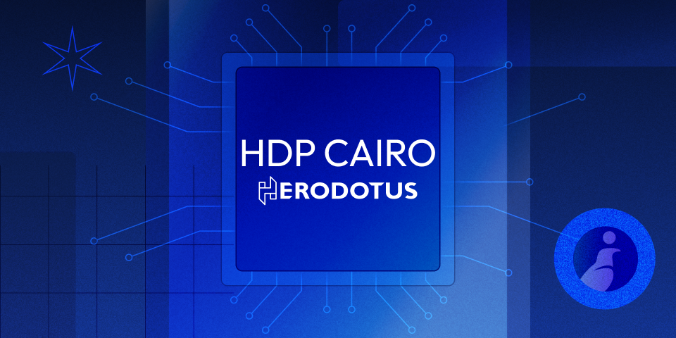

# HDP Cairo

HDP (Herodotus Data Processor) is a modular framework for validating on-chain data from multiple blockchain RPC sources, executing user-defined logic written in Cairo1, and producing an execution trace that can be used to generate a zero-knowledge proof. The proof attests to the correctness of both the on-chain data and the performed computation.

---

<p align="center">
  
</p>

---

<p align="left">
  <a href="https://herodotusdev.github.io/hdp-cairo/program_hash.json">
    
  </a>
</p>

---

## Installation

### Prerequisites

Both installation methods require Rust and `uv` (Python package manager):

1.  **Install Rust**: If you don't have Rust, install it via `rustup`.

    ```sh
    curl --proto '=https' --tlsv1.2 -sSf https://sh.rustup.rs | sh
    ```

2.  **Install uv**: Install the `uv` Python package manager.

    ```sh
    curl -LsSf https://astral.sh/uv/install.sh | sh
    ```

### Option 1: Using CLI Tool (Recommended)

Install the HDP CLI tool using the installation script:

```sh
curl -fsSL https://raw.githubusercontent.com/HerodotusDev/hdp-cairo/main/install-cli.sh | bash
```

> To install a specific version:
>
> ```sh
> VERSION=vX.X.X curl -fsSL https://raw.githubusercontent.com/HerodotusDev/hdp-cairo/main/install-cli.sh | bash
> ```

---

### Option 2: Manual Build from Source

This project uses `uv` for Python package management and `cargo` for Rust.

#### Build Steps

1.  **Clone the Repository**: Clone the repository and initialize the submodules.

    ```sh
    git clone https://github.com/HerodotusDev/hdp-cairo.git
    cd hdp-cairo
    git submodule update --init
    ```

2.  **Create Virtual Environment**: This command creates a `.venv` directory and installs all Python packages specified in `pyproject.toml`.

    ```sh
    uv sync
    ```

3.  **Activate Virtual Environment**: To use tools like `cairo-format`, you need to activate the environment.

    ```sh
    source .venv/bin/activate
    ```

---

## Running

The runtime requires RPC calls to blockchain nodes. Set up your environment variables:

- **Using CLI**: Run `hdp env-info` to see the required environment variables and get an example `.env` file.
- **Manual Build**: Copy the example environment file and edit it:

  ```sh
  cp example.env .env
  ```

  Edit the `.env` file to provide the correct RPC endpoints and configuration details.

1.  **Simulate Cairo1 Module & Collect Proof Information**:
    This step performs a dry run of your Cairo module. `module_contract_class.json` is a compiled contract from a Scarb build.

    **Using CLI**:

    ```sh
    hdp dry-run -m module_contract_class.json --print_output
    ```

    **Manual Build**:

    ```sh
    cargo run --release --bin hdp-cli -- dry-run -m module_contract_class.json --print_output
    ```

2.  **Fetch On-Chain Proofs**:
    This command fetches the necessary on-chain proofs required for the HDP run.

    **Using CLI**:

    ```sh
    hdp fetch-proofs
    ```

    **Manual Build**:

    ```sh
    cargo run --release --bin hdp-cli --features progress_bars -- fetch-proofs
    ```

3.  **Run Cairo1 Module with Verified Data**:
    This executes the module with verified on-chain data.

    **Using CLI**:

    ```sh
    hdp sound-run -m module_contract_class.json --print_output
    ```

    **Manual Build**:

    ```sh
    cargo run --release --bin hdp-cli -- sound-run -m module_contract_class.json --print_output
    ```

    The program will output the **results root** and **tasks root**, which can be used to extract the results from the on-chain contract.

---

## CLI Features

`hdp` supports the following commands:

- `hdp dry-run` - simulates module execution and collects proof metadata
- `hdp fetch-proofs` - fetches required on-chain proofs
- `hdp sound-run` - executes the verified run and can produce Cairo PIE
- `hdp program-hash` - prints HDP program hash from compiled program
- `hdp upload` - builds and uploads your module to HDP server
- `hdp execute` - builds your module and sends `POST /tasks` with inline `compiled_class`
- `hdp env-info` - prints `.env` template and required runtime envs
- `hdp link` - links installed `hdp_cairo` sources into your local project
- `hdp update` - updates the installed CLI
- `hdp pwd` - prints local HDP installation directory

For a full command reference (flags, defaults, and examples), see:

- [`crates/cli/README.md`](./crates/cli/README.md)

Examples:

```sh
hdp dry-run -m target/dev/example_eth_call_module.compiled_contract_class.json --print_output
hdp fetch-proofs
hdp sound-run -m target/dev/example_eth_call_module.compiled_contract_class.json --print_output --cairo_pie ./pie.zip
hdp program-hash
hdp env-info
```

---

## Upload Module to HDP Server (CLI)

Use `hdp upload` from your module root directory (the directory containing `Scarb.toml`).

The command:

1. Builds the module with `scarb build`
2. Finds `*.compiled_contract_class.json`
3. Collects Cairo source files from `src/`
4. Sends multipart upload to HDP server endpoint `POST /modules/upload`

### Prerequisites

- Module project contains valid `Scarb.toml` with:
  - `[package].name`
  - `[package].version`
  - Starknet contract target producing `*.compiled_contract_class.json`
- API key available via:
  - `--api-key`, or
  - `HERODOTUS_CLOUD_API_KEY` environment variable

### Basic usage

```sh
cd /path/to/your/module
hdp upload \
  --api-key "$HERODOTUS_CLOUD_API_KEY" \
  --url "http://localhost:3001"
```

### With metadata

```sh
hdp upload \
  --api-key "$HERODOTUS_CLOUD_API_KEY" \
  --url "http://localhost:3001" \
  --description "Provable ETH call module" \
  --tags "eth_call,proofs,demo" \
  --license "MIT" \
  --changelog "Initial upload"
```

### Environment-based usage

```sh
export HERODOTUS_CLOUD_API_KEY="..."
export HDP_SERVER_URL="http://localhost:3001"
hdp upload
```

### Notes

- `--url` defaults to `HDP_SERVER_URL`, then to `http://localhost:3001`.
- If upload fails, ensure HDP server has module routes enabled and your API key is valid.
- The command uploads:
  - compiled module
  - source files map
  - `Scarb.toml`
  - ABI (if present in generated contract class artifact)

---

## Testing

Tests also require chain node RPC calls, so make sure your `.env` file is set up correctly.

1.  **Build Cairo1 Modules**:

    ```sh
    scarb build
    ```

2.  **Run Tests**:
    Execute the test suite using `nextest`.

    ```sh
    cargo nextest run
    ```

---

## Note on On-Chain Finality

Even if all local stages (dry run, proof fetching, sound run) succeed, on-chain settlement depends on the **MMRs (Merkle Mountain Ranges)**. The data for all accessed values must be present in the MMRs inside [Herodotus Satellite contracts](https://github.com/HerodotusDev/satellite) used for settlement.

This means the blocks you are accessing must have been included in the settlement contract's MMRs. This is a critical consideration, especially when mixing testnet and mainnet data or for cross-chain access within the same HDP module. If you encounter issues during on-chain settlement, verify that the relevant block numbers have been included in the on-chain MMRs.

---

## Mentions

Provable ETH call (located in [hdp_cairo/src/eth_call](./hdp_cairo/src/eth_call/)) makes use of code adapted from [**Kakarot**](https://github.com/kkrt-labs) [(@kkrt-labs/kakarot-ssj)](https://github.com/kkrt-labs/kakarot-ssj) under the [MIT License](https://github.com/kkrt-labs/kakarot-ssj/blob/main/LICENSE).

Thanks for all the hard work guys 🙏

> Original project: https://github.com/kkrt-labs/kakarot-ssj  
> License file: https://github.com/kkrt-labs/kakarot-ssj/blob/main/LICENSE

---

## License

`hdp-cairo` is licensed under the [Apache-2.0 license](./LICENSE).

---
