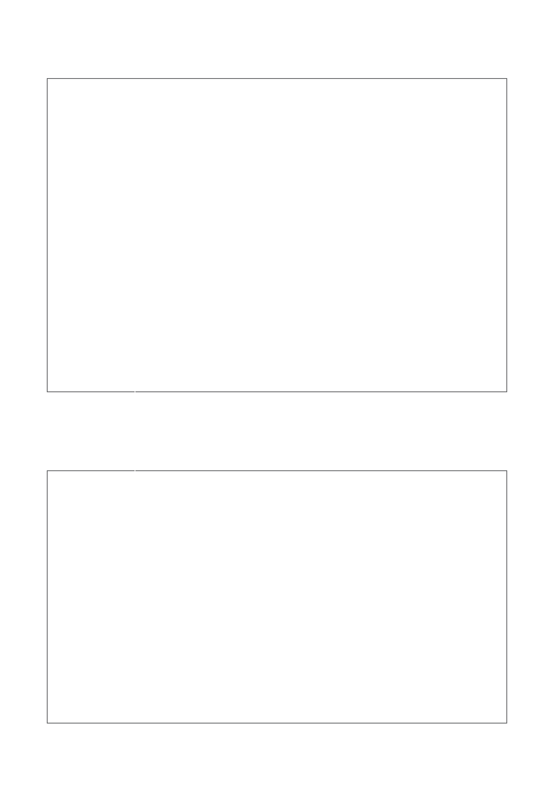

## Overview

HDP (Herodotus Data Processor) is a modular framework for validating on-chain data from multiple blockchain RPC sources, executing user-defined logic written in Cairo1, and producing an execution trace that can be used to generate a zero-knowledge proof. The proof attests to the correctness of both the on-chain data and the performed computation.

HDP is designed with a two-stage process:

### 1. Data Verification

- **RPC Data Fetch & Validation:**  
  HDP connects to blockchain RPC endpoints (e.g., Ethereum, StarkNet) to download raw data along with the necessary on-chain proofs.

- **Verifiers:**  
  Specialized circuits validate the data by checking inclusion proofs (for example, the Merkle Patricia Trie in Ethereum) and confirming that block headers are authentic and correctly linked in the chain.

- **Memorizers:**  
  Once verified, the data is stored in an internal dictionary (memorizers) to be readily available for subsequent processing.

### 2. Computation

- **User-defined Logic:**  
  Developers write modules in Cairo1, to specify the computation or checks to be performed on the data.

- **Bootloader:**  
  The bootloader loads the compiled Cairo1 bytecode. It retrieves the necessary data from the memorizers and executes the program.

- **Trace and Proof Generation:**  
  After execution, a trace is produced. This trace forms the basis for a zero-knowledge proof that attests to the correctness of the on-chain data and the user-defined computation.

This combined approach allows HDP to securely prove statements about historical on-chain events, voting power, balances, and other chain-dependent attributes in a trustless and verifiable manner.

HDP is built to support data from multiple blockchains within a single Cairo1 execution. This capability is especially useful for use cases such as bridging, where data from various chains is verified and processed within one unified pipeline.

  

